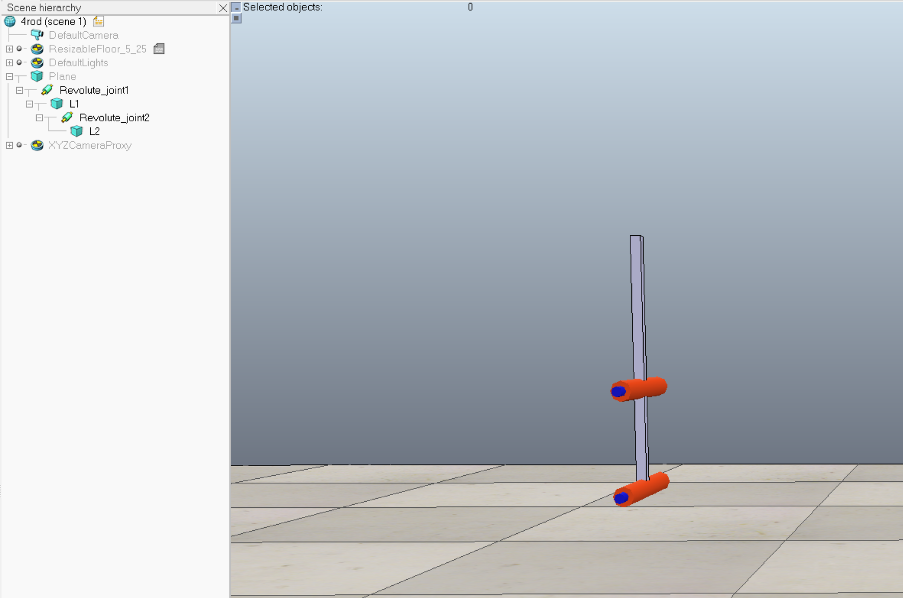
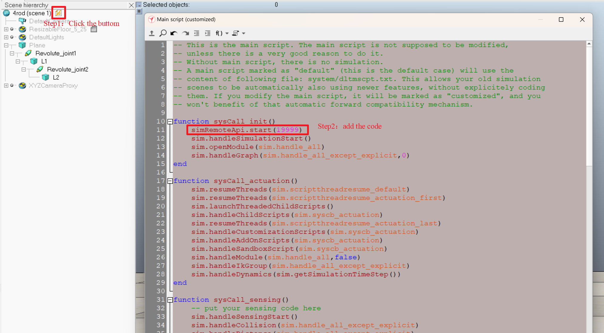
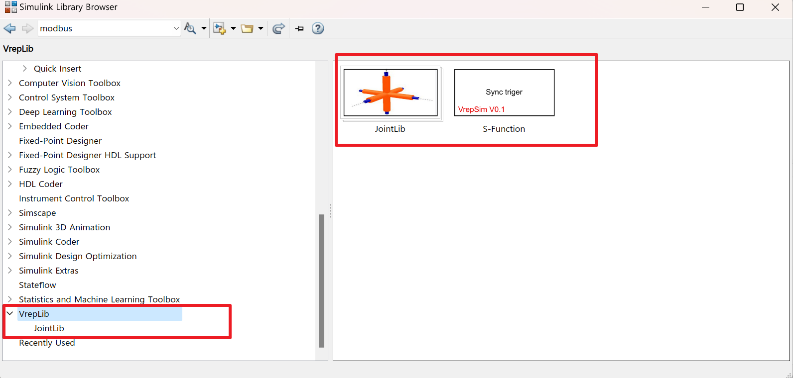
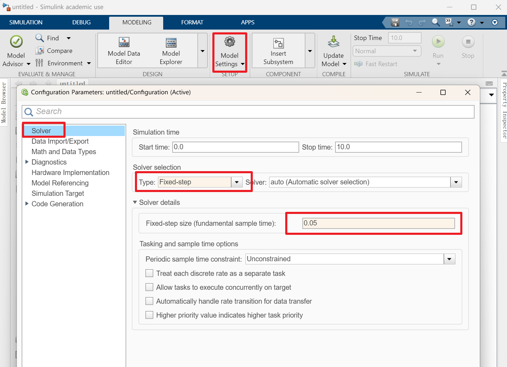
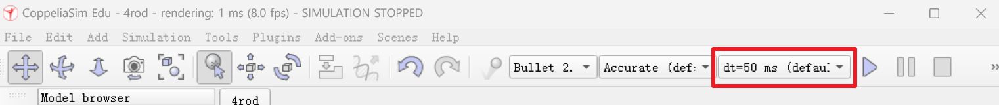
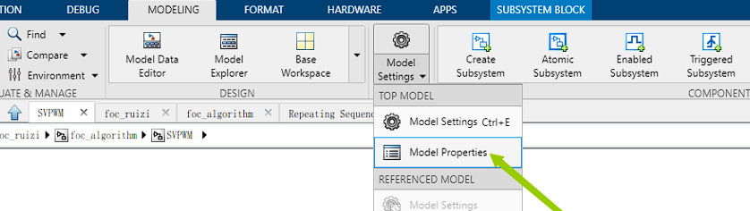
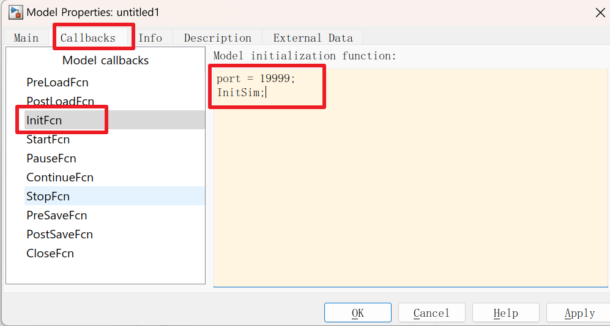

# A simple library to link Simulink and Vrep/CoppeliaSim

## A simple demo to show Usage

### Operations in Vrep

I have a simple mechanism with two links shown in figure below. 



All you have to do is open the main lua script and specify the port number. The default port is 19999.



### Operations in MATLAB/Simulink

#### Step1: Add toolbox to MATLAB Path and Refresh the Simulink Library

If everything is ok, you will see Vreplib displayed in Simulink Library



#### Step2: Create a new simulink model and set it to `Fixed-step`



The `Fixed-step size` should be chose as same as the `dt` in Vrep.



#### Set the InitFun of Simulink

1). Open the `Model Properties `



2).  Add init function



```matlab
port = 19999; % Change according to actual situation
InitSim;
```

#### Enjoy it !!!

You have to place the **Sync triger** module at the beginning of the model.

